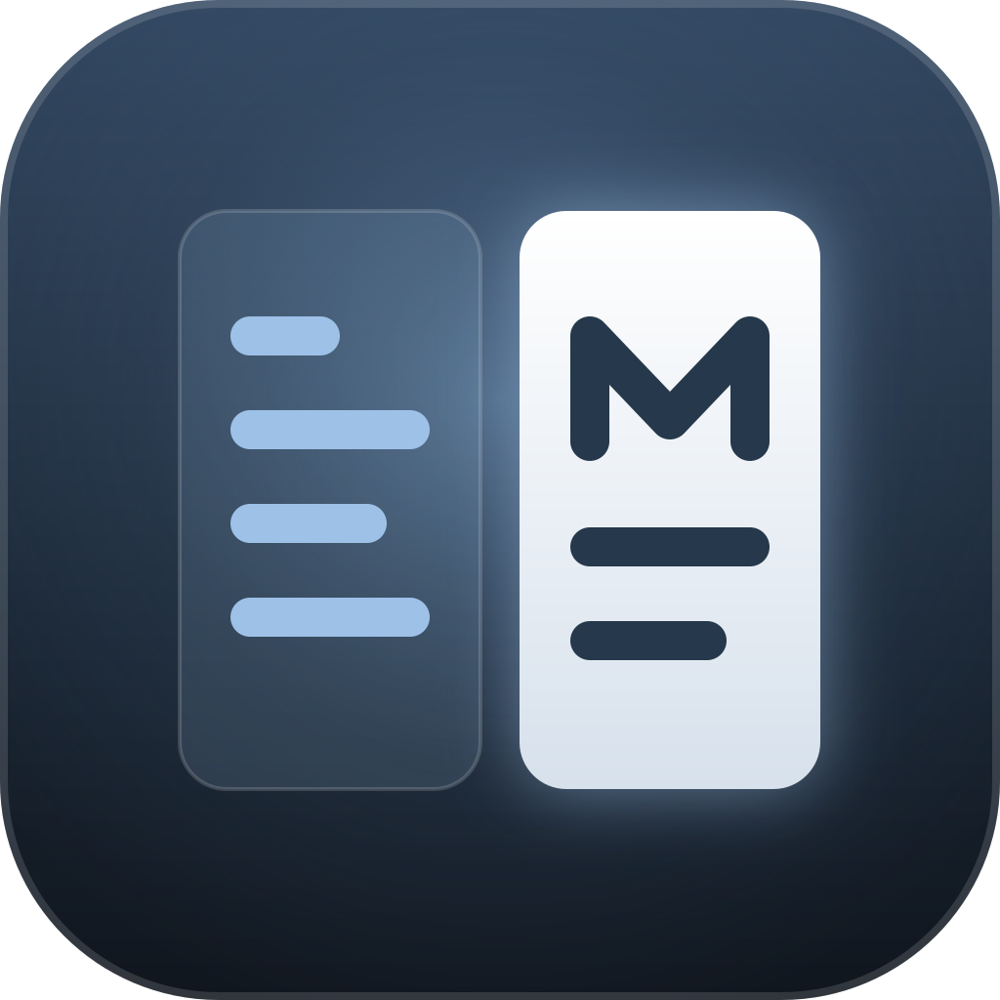

<p align="center">
  
</p>

# Markive

> macOS opens PDFs in Preview.
> Markdown deserves the same: double-click, read, done.

A native macOS Markdown viewer and editor. Open a `.md` from Finder and it renders. Switch to the editor and it's an editor. Open a folder and it becomes a workspace root — no project setup, no workspace file, no Electron.

## What it is

- **Viewer first.** Editor, Preview, and Editor-and-Preview split (⌘1/⌘2/⌘3). GitHub-style heading anchors, tables, task lists. Syntax-highlighted fenced code and rendered Mermaid diagrams, both styled to match the system's Liquid Glass material. Local images and relative links resolve — including images written as raw HTML, the way READMEs do it.
- **Editor when you need it.** A TextKit 2 text view with live Markdown syntax highlighting and list continuation/indent.
- **Workspace sidebar.** Open a folder as a root and browse it — All Documents, Recent, Favorites, and the folder tree. Rename, move to Trash, drag a document out to Finder, or use its context menu (Copy Path, Show in Finder).
- **Quick Open.** ⌘P fuzzy-searches every document under the open workspace.
- **History.** ⌘[ / ⌘] step back and forward through recently viewed documents; ⌥⌘↓ / ⌥⌘↑ move to the next or previous document in the list.
- **Safe by default.** Rendered HTML is sanitized; the preview's WKWebView blocks every network scheme and never navigates. External links open in your browser, local `.md` links open in Markive.
- **Aware of the disk.** External edits reload clean documents automatically; conflicting edits raise a banner instead of silently losing either side.
- **Native.** Real menu bar, light/dark/system appearance, Finder file associations, drag & drop, Share.

## Requirements

macOS 26 on Apple Silicon or Intel — the bundle is universal.

## Install

Grab the latest `.dmg` from [Releases](https://github.com/dariuscorvus/markive/releases), open it, and drag Markive to Applications.

Markive is unsigned. macOS quarantines web downloads, and for an unsigned app that shows up as **"Markive is damaged and can't be opened"**. It isn't. Clear the flag once:

```bash
xattr -dr com.apple.quarantine /Applications/Markive.app
```

### Build from source

```bash
macos/run.sh
```

Builds `markive-ffi` (the Rust core), then the SwiftUI app, and launches it. See [`macos/`](macos/) for the Xcode/release build path.

## Releasing

Tags matching `v*` trigger [`native-release.yml`](.github/workflows/native-release.yml), which builds a universal DMG and publishes it as the latest stable release. Add the release notes to [`CHANGELOG.md`](CHANGELOG.md) before tagging.

```bash
git fetch origin main
git tag -a v0.3.0 origin/main -m v0.3.0
git push origin v0.3.0
```

- Keep the version in `Cargo.toml`, `Cargo.lock`, and `macos/project.yml` aligned with the tag.
- `workflow_dispatch` (Actions tab → Release → Run workflow) builds the same DMG as a run artifact without publishing anything — a dry run.
- Watch it with `gh run list --workflow=native-release.yml`, or check the result with `gh release view v0.3.0`.

### Building the DMG locally

To test a release build before tagging, without pushing anything:

```bash
macos/scripts/build-dmg.sh
```

Runs the same steps as the workflow — `xcodegen generate`, an ad-hoc-signed sandboxed Release `xcodebuild`, then `hdiutil` — and produces a universal `Markive_local.dmg` in the repo root. Needs Xcode and `brew install xcodegen`.

## Command line

Settings (⌘,) → **Install Command Line Tool** puts `markive` on your PATH. Then:

```
markive notes.md              # open a file in the app
markive notes/                # open a folder as a workspace
markive render notes.md       # print sanitized HTML to stdout
echo '# hi' | markive render  # works in pipes
markive --version
```

`render` is a plain Unix filter — no window, no daemon, exits when done. Opening a file or folder hands off to the running instance and returns.

## Keyboard

| | |
|---|---|
| ⌘N / ⇧⌘N / ⌘O / ⌘P / ⌘S | New Document, New Window, Open Workspace, Quick Open, Save |
| ⌘1 / ⌘2 / ⌘3 | Editor, Preview, Editor and Preview |
| ⌘[ / ⌘] | Back, Forward |
| ⌥⌘↓ / ⌥⌘↑ | Next Document, Previous Document |
| ⌥⌘I | Toggle Inspector |

## Architecture

A Rust workspace with the parsing/rendering logic where it can be tested, and a native SwiftUI shell:

- `crates/markive-core` — parsing (pulldown-cmark), syntax highlighting (syntect), sanitizing (ammonia), path resolution, atomic saves. Pure functions, no platform types, `#![forbid(unsafe_code)]`.
- `crates/markive-ffi` — a C ABI over `markive-core` for the Swift app.
- `macos/` — the SwiftUI app: windows, sidebar, editor, preview, commands, file watching, CLI entry point.

Rendering large documents is held to a measured budget: the test suite generates 1, 5, and 20 MB fixtures, records timings, and bounds memory across repeated renders.

```bash
cargo test --workspace          # markive-core, markive-ffi
cd macos && swift test          # SwiftUI app
```

MIT — see [LICENSE](LICENSE).

---

[darius.codes](https://darius.codes)
